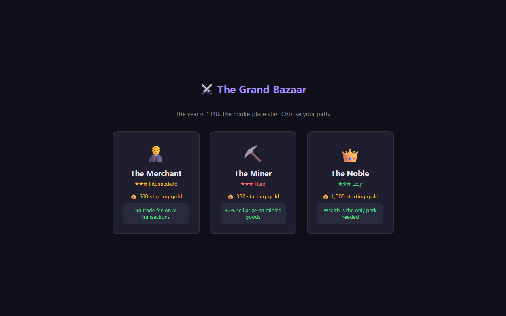
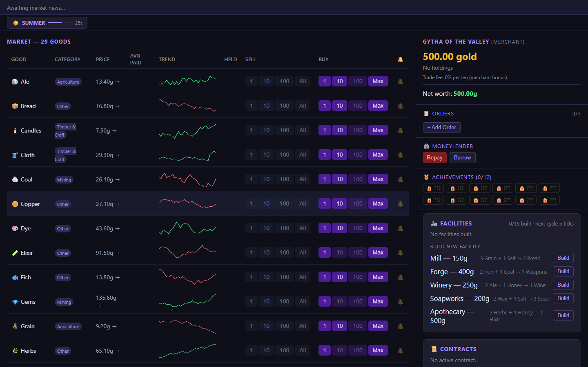

# Medieval Market

A browser-based multiplayer trading simulation set in a medieval economy. Players buy and sell goods across a live market that shifts every few seconds, driven by seasonal cycles, random events, rumours, and the collective pressure of all active traders.





## Gameplay

Each player picks a class and a name, then trades 29 goods across three categories — Agriculture, Mining, and Timber & Craft — against a shared, real-time market. Prices fluctuate every tick based on supply pressure, volatility, active events, and the current season. The goal is to finish with the highest net worth.

**Player classes**

| Class | Starting gold | Trade fee |
|-------|--------------|-----------|
| Merchant | 500g | 0% |
| Miner | 350g | 0.5% |
| Noble | 1000g | 0.5% |

**Core mechanics**

- **Seasons** — Spring, Summer, Autumn, Winter each nudge different goods up or down
- **Events** — random shocks (plague, fire, bumper harvest…) spike or crash specific goods
- **Rumours** — pay to investigate tips; true rumours hint at upcoming events
- **Limit orders** — place buy/sell orders that execute automatically when the price is hit
- **Guilds** — join one of five guilds for a passive edge (Thieves' Guild, Scholars' Guild, Sea Traders, Royal Warrant, Alchemists' Society)
- **Facilities** — build production buildings (Mill, Forge, Winery, Soapworks, Apothecary) that convert raw goods into higher-value manufactured goods every 5 ticks
- **Contracts** — accept delivery contracts for bonus gold
- **Moneylender** — borrow gold at interest
- **Black market** — occasionally surfaced contraband offers at 40–60% of market price; goods must be held for 5 ticks before they can be sold, and there's a 3% per-tick confiscation risk unless you're in the Thieves' Guild
- **Scoreboard** — live net-worth ranking updated every tick

## Tech stack

- **Backend** — Java 21, Spring Boot 3.2, Maven
- **Frontend** — Vue 3 (CDN, no build step), SockJS + STOMP WebSocket
- **Persistence** — none; all state is in-memory per session

## Quick start

1. **Start the server**
   ```bash
   mvn spring-boot:run
   ```
2. **Open** `http://localhost:8080` in your browser
3. **Create a session** — one player clicks *New Session*; the session code is displayed at the top
4. **Other players join** — enter the session code and click *Join*
5. **Pick your class and name** — Merchant for no fees, Noble for a bigger bankroll, Miner for a specialised edge
6. **Start trading** — the market ticks every few seconds; watch the price charts, react to events and rumours, and build facilities when you have capital to spare
7. **Win** — the player with the highest net worth when the session ends tops the scoreboard

Multiple browser tabs on the same machine can join the same session simultaneously.

## Running locally

```bash
mvn spring-boot:run
```

Then open `http://localhost:8080` in your browser.

## Running tests

```bash
mvn test
```
